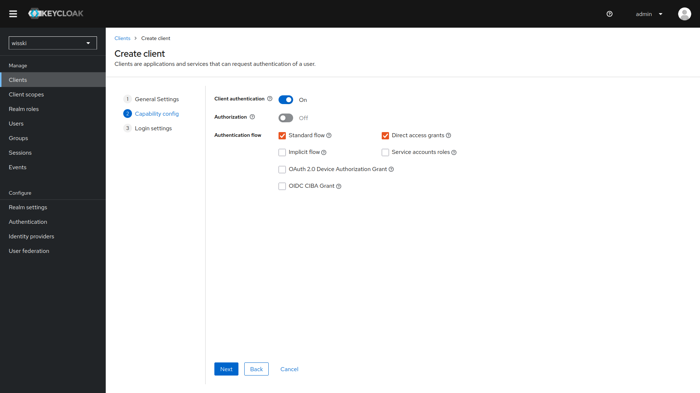
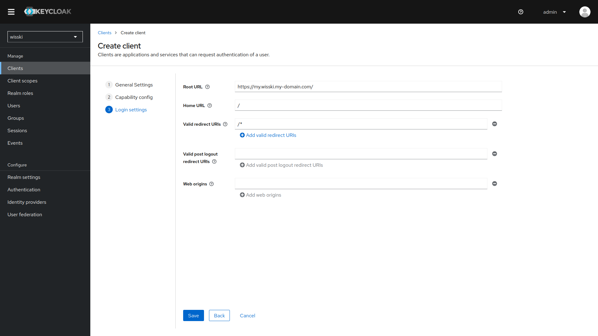
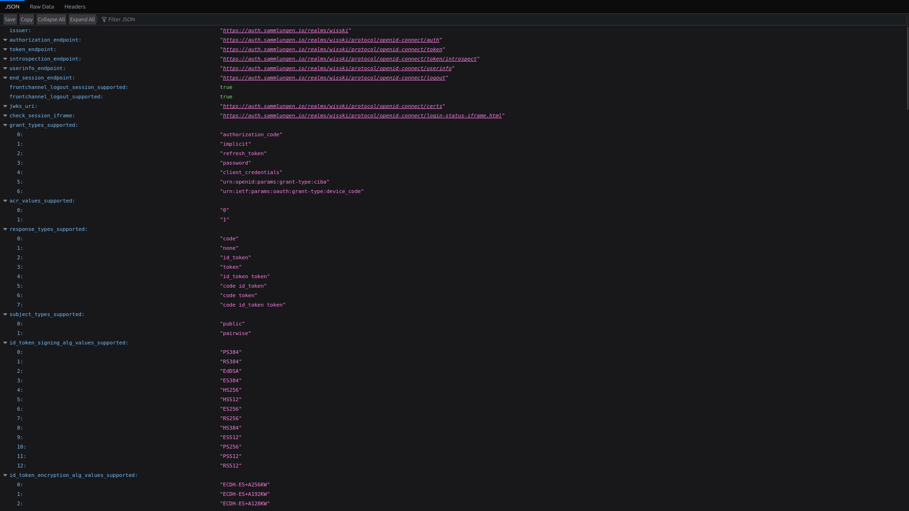
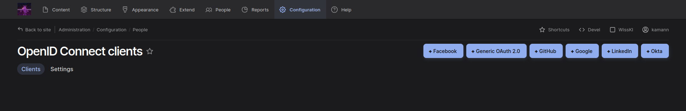

<!--

author: Kai Amann
email: kai.amann@fau.de
version:  v1
language: EN

icon:     https://raw.githubusercontent.com/chastik/Beratung_Dateityp_Bild/refs/heads/main/SODa-Logo_full.svg
link:     https://raw.githubusercontent.com/chastik/Beratung/refs/heads/main/soda.css

comment:  WissKi SODA OERs

-->

## Connecting Drupal/WissKI to an external authentication provider via `OpenID Connect`

## Requirements
- A running Drupal/WissKI instance with
    - Shell access (e.g. though SSH or direct access to Docker container) 
    - [`composer`](https://getcomposer.org/) installed
    - (optional) [`drush`](https://www.drush.org/13.x/) installed
- A running external authentication provider (we will go with [Keycloak](https://www.keycloak.org/) in this example)

## Keycloak Steps
1. Follow the [Keycloak documentation](https://www.keycloak.org/docs/latest/server_admin/index.html#_configuring-realms) to set up a new `Realm`.
2. Create a new `Client` in this realm:
    - General Settings:
        - `Client Type`: OpenID Connect
        - `Client ID`: usually the full URL of your Drupal/WissKI instance e.g. https://my.wisski.my-domain.com
        - You can leave the rest empty/as is
          
    - Capability Config:
        - Turn `Client authentication` on
        - leave rest as is
          
    - Login Settings:
        - `Root URL`: set the Domain of your Drupal/WissKI instance
        - `Home URL`: `/`
        - `Valid redirect URLs`: `/*`
        - leave rest as is
          
3. After you have created the Client select it in the client list, navigate to the `Credentials` tab and copy the `Client Secret` for later use.
4. Also open the `OpenID Endpoint Configuration` in a new tab. (You can find this by Clicking on `Realm settings` on the left sidebar, then scrolling down to the `Endpoints` section and clicking on `OpenID Endpoint Configuration` (You can also just visit `realms/REALM_NAME/.well-known/openid-configuration` on your Keycloak, where `REALM_NAME` is the name you chose for the Realm you created). This should open a page that displays some JSON file containing information about the endpoint and should look like this: 

## WissKI/Drupal Steps
1. Get into the console
2. Download the [OpenID Connect/OAuth Client Module](https://www.drupal.org/project/openid_connect) using `composer`
    - usually `composer require drupal/openid_connect` should to the trick
3. Enable the module using `drush`: `drush en openid_connect` (Alternatively you can enable it though the `Extend` interface in Drupal https://my.wisski.my-domain.com/admin/modules)
4. Configure the OIDC module: https://my.wisski.my-domain.com/admin/config/people/openid-connect
    - Add a new `Generic Oauth 2.0` Client
      
    - Configuration:
        - `Name`: Will be displayed on the login page
        - `Client ID`: Use the Client ID you set in the Keycloak client
        - `Client secret`: The secret you copied from earlier
        - `Allowed domains`: `*`
        - `Endpoints`: Copy the values from the `OpenID Endpoint Configuration` you have open in another tab.
        - `Scopes`: openid email groups
5. In the Drupal `OpenID Connect Settings` (`admin/config/people/openid-connect/settings`) set `OpenID buttons display in user login form` to either replace the default login on the login page, or be displayed above, or below the default login fields.
6. In case you have any roles in the Keycloak that you want to map to Drupal roles you can do that in the `EXPERIMENTAL - User role mapping` section. 

